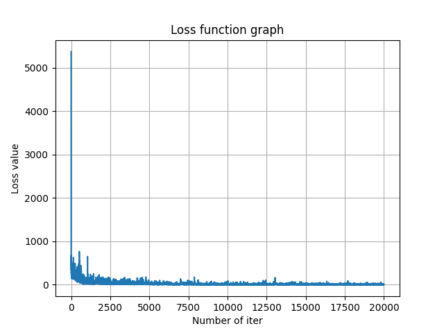
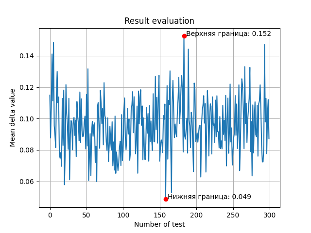

# GameGun
## Главная мысль
Использовать сеть для решения задачи поиска начальной скорости снаряда по углу наклона пушки и расстояния до цели.
## Краткое описание
Для решения задачи использовалась сеть с двумя линейными слоями (128 и 16 нейронов) и тремя функциями ***ReLU***. Формировалось два массива данных - ***train_data***, ***test_data***. Соответственно для обучения и оценки получаемых результатов.
## Результаты работы
Получилось добиться точности в 85-94% от целевого значения. На графиках ниже представлена функция потерь и оценка точности найденных значений.

  

